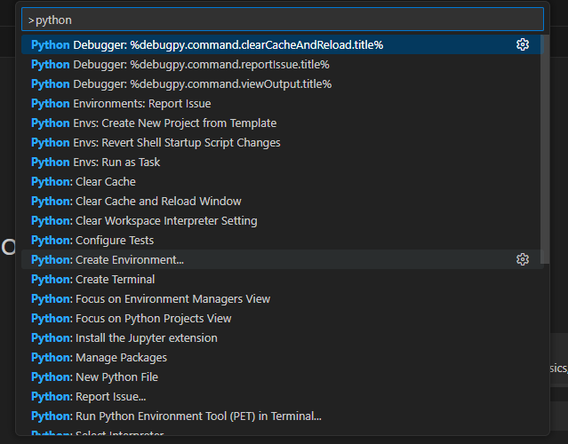
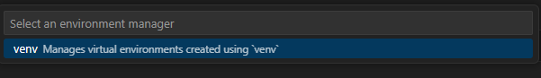
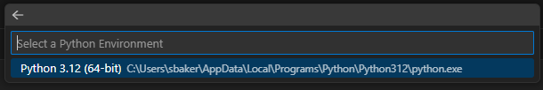
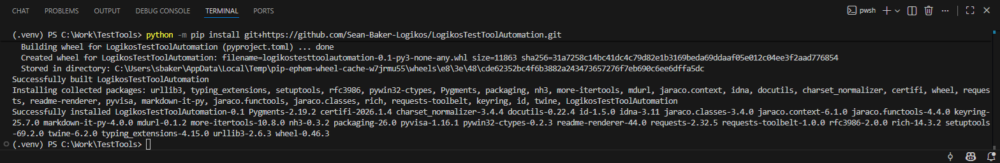
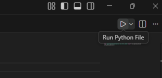
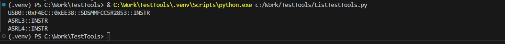

# LogikosTestToolAutomation
Logikos Test Tool Automation Helper Scripts

# Installation

Install Python for Windows (if not already installed)

    winget install Python.Python.3.12

Note: If a different version of Python is required for something else, install that version instead. LogikosTestToolAutomation should run on any version after Python 3.6 (maybe).

Install Visual Studio Code

    winget install Microsoft.VisualStudioCode

Run Visual Studio Code.
Click the Extensions icon on the left, and install the extension for Python.
Install the extension for Python Environments if it is not also installed automatically.

Create a folder to work out of. In this example, the directory is C:\Work\TestTools

In Visual Studio Code, select File / Open Folder and select that folder.

Press Ctrl-Shift-P, type in "python" and select "Python: Create Environment..."

In the next prompt, select "venv"

Then select Python 3.12 (or whatever version that was installed above)

Accept ".venv" and skip package installation.

In the View menu, select Terminal

A new window should open at the bottom with a command prompt. In the terminal window, enter:

    python -m pip install -U git+https://github.com/Sean-Baker-Logikos/LogikosTestToolAutomation.git

# Run Sample Code

In your working folder, create a new file "list_test_tools.py" and open that file in Visual Studio Code.

Enter the following code:

    from LogikosTestToolAutomation.test_tool_common import list_pyvisa_devices
    list_pyvisa_devices()

Save the file, and in the top right corner click the "Run Python File" button

If you have a test tool connected, you should see something like the following:

# Documentation and Examples

- [SDS1104X](LogikosTestToolAutomation/Documentation/SDS1104X.md)

